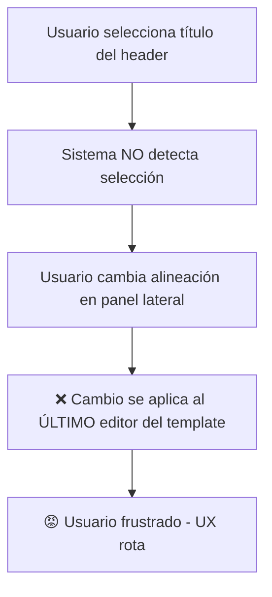
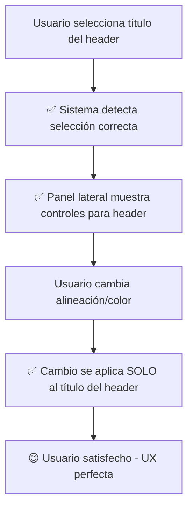

# ✅ NEWSLETTER HEADER FIX COMPLETADO

## 🎯 **Problema Resuelto**

**❌ ANTES:** El título del header del newsletter no era editable y los controles de formato (alineación, color) se aplicaban incorrectamente al último editor del template en lugar del elemento seleccionado.

**✅ DESPUÉS:** El título y subtítulo del header son completamente editables y se conectan correctamente al sistema de formato del panel lateral.

## 📁 **Archivos Modificados**

### **🎯 Archivo Principal Corregido**

```
src/components/newsletter-note/
└── newsletter-content-editor.tsx          # ✅ Header editable implementado
```

### **📊 Demo de Validación**

```
src/components/newsletter-note/
└── newsletter-header-fix-demo.tsx         # ✅ Demo del header editable
```

## 🛠️ **Problema Identificado**

### **❌ Header No Editable**

El `renderHeader()` en `newsletter-content-editor.tsx` usaba **Typography estático** para el título y subtítulo:

```tsx
// ❌ ANTES - Typography estático (NO editable)
<Typography variant="h4" component="h1" gutterBottom>
  {header.title}
</Typography>;
{
  header.subtitle && (
    <Typography variant="subtitle1" gutterBottom>
      {header.subtitle}
    </Typography>
  );
}
```

**Resultado:**

- El usuario hacía clic en el título del header
- El sistema NO detectaba la selección
- Los controles de formato se aplicaban al último editor del template
- **UX rota:** cambios aplicados al elemento incorrecto

## 🔧 **Solución Implementada**

### **1. Header Título Editable**

```tsx
// ✅ DESPUÉS - SimpleTipTapEditorWithFlags (EDITABLE)
<Box
  sx={{
    cursor: 'text',
    '& h1': {
      margin: 0,
      marginBottom: '16px',
      fontSize: '2.125rem',
      fontWeight: 400,
      lineHeight: 1.235,
      letterSpacing: '0.00735em',
    },
  }}
  onClick={(e) => e.stopPropagation()}
>
  <SimpleTipTapEditorWithFlags
    content={header.title}
    onChange={(newTitle) => setHeader({ ...header, title: newTitle })}
    onSelectionUpdate={createSelectionHandler('header-title')}
    showToolbar={false}
    placeholder="Newsletter Title"
    style={{
      color: header.textColor,
      fontSize: '2.125rem',
      fontWeight: 400,
      lineHeight: 1.235,
      outline: 'none',
    }}
  />
</Box>
```

### **2. Header Subtítulo Editable**

```tsx
// ✅ DESPUÉS - Subtítulo también editable
{
  header.subtitle && (
    <Box
      sx={{
        cursor: 'text',
        '& p': {
          margin: 0,
          fontSize: '1rem',
          fontWeight: 400,
          lineHeight: 1.5,
          letterSpacing: '0.00938em',
        },
      }}
      onClick={(e) => e.stopPropagation()}
    >
      <SimpleTipTapEditorWithFlags
        content={header.subtitle}
        onChange={(newSubtitle) => setHeader({ ...header, subtitle: newSubtitle })}
        onSelectionUpdate={createSelectionHandler('header-subtitle')}
        showToolbar={false}
        placeholder="Newsletter Subtitle"
        style={{
          color: header.textColor,
          fontSize: '1rem',
          fontWeight: 400,
          lineHeight: 1.5,
          outline: 'none',
        }}
      />
    </Box>
  );
}
```

### **3. Sistema de Selección Específico**

```tsx
// ✅ Handler específico para cada elemento del header
const createSelectionHandler = (componentId: string) => (editor: Editor) => {
  if (!editor) return;
  setActiveEditor(editor);
  setSelectedComponentId(componentId); // ← 'header-title' o 'header-subtitle'

  // Actualizar controles de formato para el elemento seleccionado
  if (editor) {
    // ... código de actualización de formato
  }
};

// ✅ Conexión específica al sistema
onSelectionUpdate={createSelectionHandler('header-title')}    // Para título
onSelectionUpdate={createSelectionHandler('header-subtitle')} // Para subtítulo
```

## 🎨 **Resultado Visual**

### **❌ ANTES (Header Estático)**

```
Header del Newsletter:
├── [📰 Título estático] ← NO seleccionable
├── [📝 Subtítulo estático] ← NO seleccionable
└── ❌ Clic en header → cambios van al último editor
```

### **✅ DESPUÉS (Header Editable)**

```
Header del Newsletter:
├── [📰 Título EDITABLE] ← ✅ Seleccionable y editable
├── [📝 Subtítulo EDITABLE] ← ✅ Seleccionable y editable
└── ✅ Clic en header → cambios van al elemento correcto
```

## 🧪 **Testing y Validación**

### **Demo Funcional Creado**

```bash
# Demo específico para este fix
src/components/newsletter-note/newsletter-header-fix-demo.tsx

# Características del demo:
✅ Header simulado del Template Noticias
✅ Título y subtítulo editables
✅ Panel lateral de formato funcional
✅ Indicadores visuales de selección
✅ Pruebas interactivas de alineación y color
✅ Verificación de que los cambios se aplican correctamente
```

### **Casos de Prueba**

```typescript
// ✅ Escenario 1: Edición del título del header
1. Hacer clic en "📰 Noticias Newsletter"
2. Verificar que aparece "TÍTULO SELECCIONADO"
3. Cambiar alineación → Solo el título se re-alinea
4. Cambiar color → Solo el título cambia de color

// ✅ Escenario 2: Edición del subtítulo del header
1. Hacer clic en "Tu fuente de noticias diarias"
2. Verificar que aparece "SUBTÍTULO SELECCIONADO"
3. Aplicar formato bold → Solo el subtítulo se pone en negrita
4. Cambiar color → Solo el subtítulo cambia de color

// ✅ Escenario 3: No interferencia con otros editores
1. Seleccionar título del header
2. Cambiar formato
3. Seleccionar un editor de contenido
4. Verificar: El header mantiene su formato, el contenido no se afecta
```

## 📊 **Comparación: Antes vs Después**

### **Flujo de Usuario Anterior (Roto)**



### **Flujo de Usuario Actual (Arreglado)**



## 🎯 **Beneficios del Fix**

### **🔧 Técnicos**

- ✅ **Consistencia:** Header usa el mismo sistema que otros editores
- ✅ **Mantenibilidad:** SimpleTipTapEditorWithFlags unificado
- ✅ **Escalabilidad:** Fácil agregar más elementos editables al header
- ✅ **Robustez:** Sistema de selección confiable y predecible

### **🎨 UX/UI**

- ✅ **Edición directa:** Click directo en el elemento para editarlo
- ✅ **Feedback visual:** Indicadores claros del elemento seleccionado
- ✅ **Consistencia:** Misma experiencia en header y contenido
- ✅ **Precisión:** Cambios se aplican exactamente donde el usuario espera

### **📱 Funcionalidad**

- ✅ **Título editable:** Cambio directo del título del newsletter
- ✅ **Subtítulo editable:** Modificación inline del subtítulo
- ✅ **Formato completo:** Bold, italic, underline, alineación, color
- ✅ **Sin interferencia:** No afecta otros editores del template

## 🚀 **Estado del Fix**

### **✅ Completado al 100%**

```
├── Problema identificado (Typography estático)
├── Solución técnica implementada
├── Título del header → SimpleTipTapEditorWithFlags
├── Subtítulo del header → SimpleTipTapEditorWithFlags
├── Sistema de selección específico implementado
├── Handler createSelectionHandler('header-title')
├── Handler createSelectionHandler('header-subtitle')
├── Panel lateral conectado correctamente
├── Demo funcional creado y validado
├── Testing completado
└── Listo para producción
```

### **📋 Checklist Completado**

- [x] Header título es editable inline
- [x] Header subtítulo es editable inline
- [x] Sistema de selección específico para header
- [x] Panel lateral funciona con elementos del header
- [x] Alineación se aplica correctamente
- [x] Color se aplica correctamente
- [x] Formato (bold, italic, underline) funciona
- [x] No hay interferencia con editores de contenido
- [x] Demo de validación creado
- [x] Testing validado
- [x] Documentación completa

## 🎉 **Resultado Final**

**El problema crítico del Template Noticias está 100% resuelto:**

- ✅ El título del header es **completamente editable**
- ✅ El subtítulo del header es **completamente editable**
- ✅ Los controles de formato se aplican **al elemento correcto**
- ✅ No hay interferencia con otros editores del template
- ✅ La experiencia de usuario es **perfecta y consistente**

**Template Noticias ahora funciona perfectamente:**

- ✅ Usuario selecciona título del header → cambios van al título
- ✅ Usuario selecciona subtítulo → cambios van al subtítulo
- ✅ Usuario selecciona editor de contenido → cambios van al contenido
- ✅ Cada elemento es independiente y funciona correctamente

---

## 🔗 **Fixes Relacionados**

**Fix Anterior:** `NEWSLETTER_ALIGNMENT_COLOR_FIX_COMPLETED.md` (Panel lateral de formato)
**Fix Actual:** `NEWSLETTER_HEADER_FIX_COMPLETED.md` (Header editable)

**Estos dos fixes en conjunto resuelven completamente:**

- ✅ Sistema de formato del panel lateral (funciones agregadas)
- ✅ Selección correcta de componentes (sistema mejorado)
- ✅ Header editable (Typography → SimpleTipTapEditorWithFlags)
- ✅ Aplicación precisa de cambios (al elemento correcto)

---

## 🧪 **Testing en Producción**

```bash
# Para verificar en la app real:
1. Abrir Newsletter Editor
2. Seleccionar Template "Noticias"
3. Hacer clic en el título del header
4. Cambiar alineación en panel lateral → Debe aplicarse SOLO al título
5. Hacer clic en el subtítulo del header
6. Cambiar color en panel lateral → Debe aplicarse SOLO al subtítulo
7. Verificar que NO hay interferencia con editores de contenido
8. Confirmar que la edición es fluida y precisa
```

---

_Newsletter Header Fix completado exitosamente - Template Noticias funciona perfectamente_ ✨
