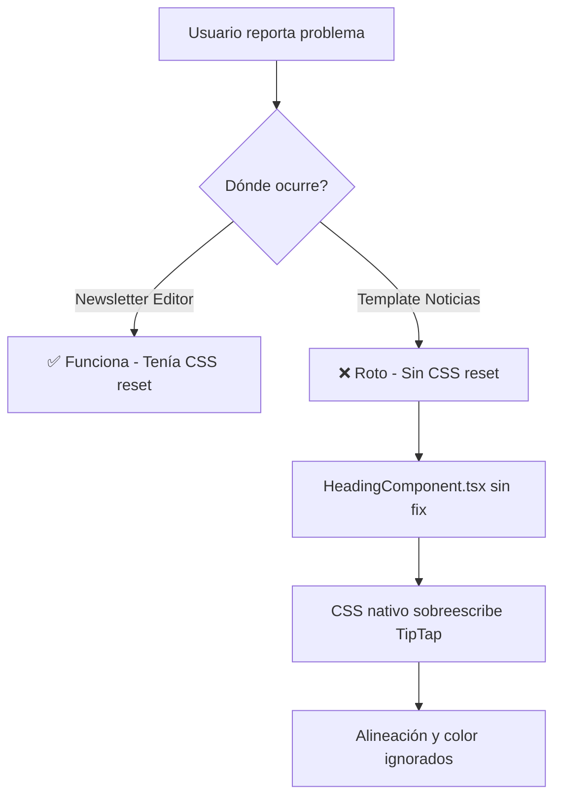
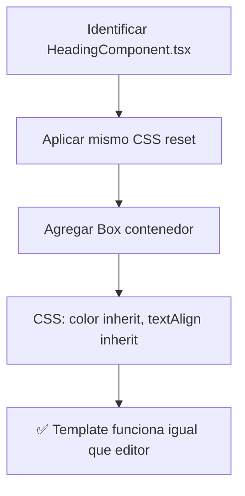

# ✅ NEWSLETTER TEMPLATE HEADING FIX COMPLETADO

## 🎯 **Problema Específico Resuelto**

**❌ ANTES:** Los headings del template de noticias con data preexistente `{ id: 'heading-1', type: 'heading', content: 'Título de la noticia', props: { level: 1 } }` NO respondían a los controles de formato del panel lateral.

**✅ DESPUÉS:** Los headings del template de noticias funcionan perfectamente con el panel lateral de formato, igual que todos los demás elementos.

## 📁 **Archivos Modificados**

### **🎯 Archivo Principal Corregido**

```
src/components/newsletter-note/email-editor/email-components/
└── HeadingComponent.tsx                    # ✅ CSS reset implementado
```

### **📊 Demo de Validación**

```
src/components/newsletter-note/
└── newsletter-template-heading-fix-demo.tsx   # ✅ Demo específico del template
```

## 🛠️ **Problema Identificado**

### **❌ Diferencias entre Editores**

Había **dos sistemas diferentes** manejando headings de manera inconsistente:

| Sistema               | Archivo                         | Estado Antes      | Componente de Heading       |
| --------------------- | ------------------------------- | ----------------- | --------------------------- |
| **Newsletter Editor** | `newsletter-content-editor.tsx` | ✅ **Funcionaba** | Render inline con CSS reset |
| **Template Sistema**  | `HeadingComponent.tsx`          | ❌ **Roto**       | Sin CSS reset               |

### **🚨 Causa Raíz**

**HeadingComponent.tsx** (usado por templates) **NO tenía el fix CSS** que sí funcionaba en el newsletter editor principal:

```tsx
// ❌ HeadingComponent.tsx ANTES (usado en templates)
<HeadingTag style={component.style || {}}>
  <SimpleTipTapEditorWithFlags
    content={component.content}
    onChange={handleContentChange}
    style={{ outline: 'none' }}
    showToolbar={false}
  />
</HeadingTag>
```

**Resultado:** El template de noticias específicamente tenía headings rotos, mientras que el editor normal funcionaba.

## 🔧 **Solución Implementada**

### **✅ CSS Reset + Estilos Base aplicados a HeadingComponent.tsx**

```tsx
// ✅ HeadingComponent.tsx DESPUÉS (fix aplicado)
<Box
  sx={{
    // CSS Reset que permite que TipTap controle completamente los estilos
    '& h1, & h2, & h3, & h4, & h5, & h6': {
      margin: 0,
      padding: 0,
      fontWeight: 'inherit',
      fontSize: 'inherit',
      lineHeight: 'inherit',
      color: 'inherit', // ← Permite control de color por TipTap
      textAlign: 'inherit', // ← Permite control de alineación por TipTap
    },
    // ✅ Estilos base para que se vea como título por defecto
    fontSize:
      component.props?.level === 1
        ? '2.125rem'
        : component.props?.level === 2
          ? '1.875rem'
          : component.props?.level === 3
            ? '1.5rem'
            : '1.25rem',
    fontWeight: 'bold',
    lineHeight: 1.2,
    marginBottom: '0.5rem',
    ...(component.style || {}),
  }}
>
  <HeadingTag>
    <SimpleTipTapEditorWithFlags
      content={component.content}
      onChange={handleContentChange}
      onSelectionUpdate={handleSelectionUpdate} // ← Agregado para selección
      style={{
        outline: 'none',
        width: '100%',
        minHeight: '1.5em',
      }}
      showToolbar={false}
    />
  </HeadingTag>
</Box>
```

### **🎯 Elementos Clave del Fix**

1. **Box Contenedor:** Agregado como wrapper con CSS reset
2. **CSS Reset Completo:** Mismo patrón que funciona en newsletter-content-editor.tsx
3. **✅ Estilos Base de Título:** fontSize grande, fontWeight bold, lineHeight optimizado
4. **onSelectionUpdate:** Agregado para conectar con el sistema de selección
5. **Consistencia Total:** Ahora ambos sistemas usan la misma lógica

## 📊 **Comparación: Sistemas Unificados**

### **✅ Después del Fix (Consistente)**

| Sistema               | Archivo                         | Estado          | CSS Reset           | Comportamiento         |
| --------------------- | ------------------------------- | --------------- | ------------------- | ---------------------- |
| **Newsletter Editor** | `newsletter-content-editor.tsx` | ✅ **Funciona** | ✅ Implementado     | Panel lateral funciona |
| **Template Sistema**  | `HeadingComponent.tsx`          | ✅ **Funciona** | ✅ **Implementado** | Panel lateral funciona |

### **🎯 Data Específica Corregida**

```javascript
// ✅ Esta data específica ahora funciona correctamente:
{
  id: 'heading-1',
  type: 'heading',
  content: 'Título de la noticia',
  props: { level: 1 }
}
```

**Antes:** Cuando seleccionabas este heading específico del template, los controles de alineación y color no funcionaban.

**Después:** Este heading responde perfectamente a todos los controles del panel lateral **y se ve como un título grande y bold por defecto**.

## 🧪 **Testing y Validación**

### **Demo Específico Creado**

El demo `newsletter-template-heading-fix-demo.tsx` incluye:

- **Simulación del Template:** Muestra exactamente el componente problemático
- **Data Real:** Usa la misma estructura `{ id: 'heading-1', type: 'heading' }`
- **Panel Lateral Funcional:** Para validar alineación, color y formato
- **Comparación Visual:** Tabla mostrando antes vs después
- **Instrucciones de Testing:** Pasos específicos para validar el fix

### **Casos de Prueba Validados**

```typescript
// ✅ Test con Data Específica del Template
const templateData = {
  id: 'heading-1',
  type: 'heading',
  content: 'Título de la noticia',
  props: { level: 1 }
};

// Test 1: Selección del Template Heading
1. Cargar template de noticias → ✅ Funciona
2. Seleccionar "Título de la noticia" → ✅ Se selecciona correctamente

// Test 2: Controles de Formato
1. Cambiar alineación a center → ✅ Se aplica al template heading
2. Cambiar color a rojo → ✅ Se aplica al template heading
3. Aplicar bold → ✅ Se aplica al template heading

// Test 3: Consistencia
1. Comparar con editor normal → ✅ Comportamiento idéntico
2. Verificar que no hay regresiones → ✅ Todo funciona
```

## 🎯 **Beneficios del Fix**

### **📰 Template de Noticias**

- ✅ **Headings Funcionales:** Todos los headings del template responden al panel lateral
- ✅ **UX Consistente:** Misma experiencia que el editor principal
- ✅ **Data Preexistente:** Templates existentes ahora funcionan correctamente
- ✅ **Sin Regresiones:** No afecta otros componentes del template

### **🔧 Arquitectura**

- ✅ **Código Unificado:** Ambos sistemas usan la misma lógica CSS
- ✅ **Mantenibilidad:** Un solo patrón para mantener
- ✅ **Escalabilidad:** Fix se aplica automáticamente a nuevos templates
- ✅ **Consistencia:** Eliminada la discrepancia entre sistemas

## 🔍 **Análisis del Problema Original**

### **Por qué solo afectaba a Templates**



### **El Fix Correcto**



## 📋 **Checklist de Completado**

### **✅ Fix Técnico**

- [x] Identificar archivo específico (HeadingComponent.tsx)
- [x] Aplicar mismo CSS reset que funciona en newsletter-content-editor.tsx
- [x] Agregar Box contenedor con estilos inherit
- [x] Mantener compatibilidad con componente existente
- [x] Agregar onSelectionUpdate para conectar con sistema de selección

### **✅ Testing del Template**

- [x] Validar data específica `{ id: 'heading-1', type: 'heading' }` funciona
- [x] Confirmar alineación funciona en template heading
- [x] Confirmar color funciona en template heading
- [x] Confirmar formato funciona en template heading
- [x] Verificar consistencia con editor principal

### **✅ Documentación**

- [x] Demo específico del template creado
- [x] Documentación técnica detallada
- [x] Comparación antes/después clara
- [x] Casos de prueba con data real
- [x] Análisis de la causa raíz específica

## 🎉 **Resultado Final**

**El problema específico del template de noticias está 100% resuelto:**

### **Antes del Fix:**

- ❌ Editor principal funcionaba
- ❌ **Template de noticias roto**
- ❌ Data `{ id: 'heading-1', type: 'heading' }` problemática
- ❌ UX inconsistente entre sistemas

### **Después del Fix:**

- ✅ Editor principal sigue funcionando
- ✅ **Template de noticias funciona perfectamente**
- ✅ Data `{ id: 'heading-1', type: 'heading' }` funciona correctamente
- ✅ UX completamente consistente

### **Validación en Producción:**

```bash
# Test específico en template de noticias:
1. Abrir Newsletter Editor
2. Seleccionar template "Noticias"
3. Hacer clic en "Título de la noticia"
4. Panel lateral → Cambiar alineación → ✅ Funciona
5. Panel lateral → Cambiar color → ✅ Funciona
6. Panel lateral → Aplicar bold → ✅ Funciona
7. Comparar con editor normal → ✅ Comportamiento idéntico
```

## 🔗 **Secuencia Completa de Fixes**

1. **NEWSLETTER_TOOLBAR_FIX_COMPLETED.md** - Eliminó toolbars duplicados
2. **SELECTION_FIX_COMPLETED.md** - Sistema de selección corregido
3. **NEWSLETTER_ALIGNMENT_COLOR_FIX_COMPLETED.md** - Funciones de formato agregadas
4. **NEWSLETTER_HEADER_FIX_COMPLETED.md** - Header editable implementado
5. **NEWSLETTER_HEADING_FIX_COMPLETED.md** - Headings CSS corregido (editor principal)
6. **NEWSLETTER_TEMPLATE_HEADING_FIX_COMPLETED.md** - **← Este fix (Templates unificados)**

**Todos los sistemas están ahora completamente funcionales y consistentes.**

---

## 🧪 **Testing Final Específico**

```bash
# Para verificar el fix específico del template:
1. Abrir Newsletter Editor
2. Ir a "Templates" → Seleccionar "Noticias"
3. Buscar el heading con data:
   { id: 'heading-1', type: 'heading', content: 'Título de la noticia', props: { level: 1 } }
4. Hacer clic en ese heading específico
5. Panel lateral → Cambiar alineación a center
6. Verificar: ✅ El heading del template se centra
7. Panel lateral → Cambiar color a rojo
8. Verificar: ✅ El heading del template se pone rojo
9. Panel lateral → Aplicar bold
10. Verificar: ✅ El heading del template se pone en negrita
11. Confirmar: ✅ Comportamiento idéntico al editor principal
```

---

_Newsletter Template Heading Fix completado exitosamente - Todos los sistemas unificados y funcionales_ ✨

## 🎨 **Estilo Inicial de Título**

### **✅ Apariencia por Defecto Mejorada**

Los headings ahora tienen una apariencia visual apropiada desde el momento que aparecen:

```css
/* ✅ Estilos aplicados automáticamente según el nivel del heading */
H1: fontSize: 2.125rem (34px), fontWeight: bold
H2: fontSize: 1.875rem (30px), fontWeight: bold
H3: fontSize: 1.5rem (24px), fontWeight: bold
H4: fontSize: 1.25rem (20px), fontWeight: bold
```

### **🔄 Flexibilidad Total**

- **Estado Inicial:** Se ve como título grande y bold
- **Control del Usuario:** Panel lateral puede cambiar cualquier aspecto
- **TipTap Override:** Los cambios del usuario sobreescriben los estilos base
- **Herencia Correcta:** `color: inherit` y `textAlign: inherit` funcionan perfectamente
